Ujian Akhir Semester : Deploy 2 System Apps Static Web dan Dynamic Web
1. Membuat Insteance baru pada AWS Region ap-southeast-1 Singapore
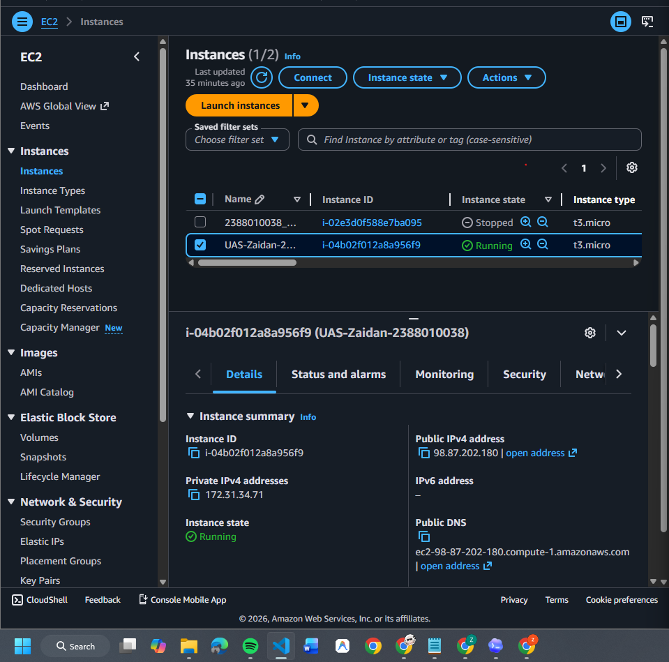

2. Membuat Folder Project
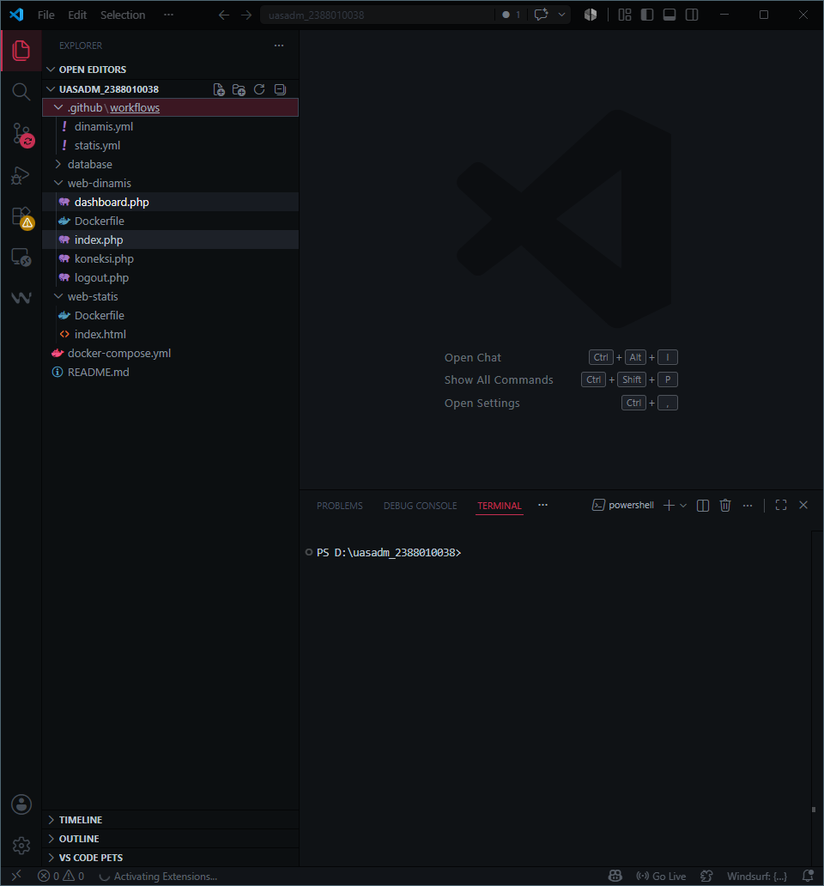

3. membuat dynamic-app menggunakan php
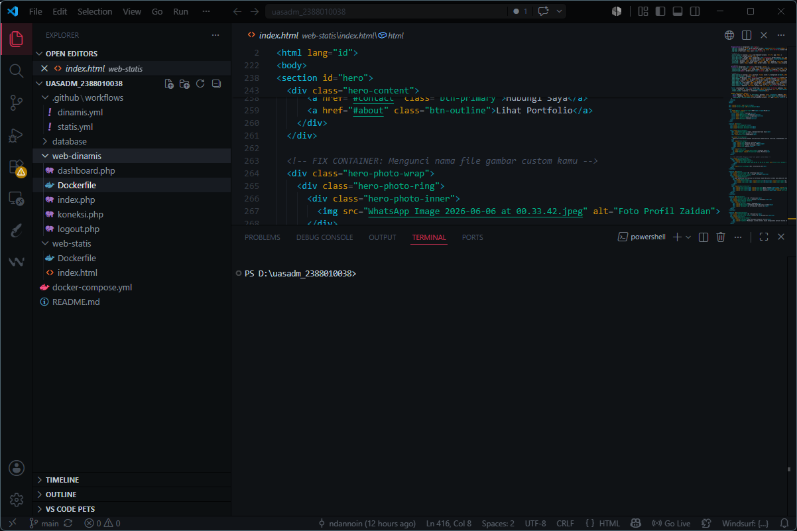

4. Install Docker
"sudo apt update"
"sudo apt install -y ca-certificates curl gnupg"
"sudo install -m 0755 -d /etc/apt/keyrings"
"curl -fsSL https://download.docker.com/linux/ubuntu/gpg | sudo gpg --dearmor -o /etc/apt/keyrings/docker.gpg"
"sudo chmod a+r /etc/apt/keyrings/docker.gpg"
". /etc/os-release"
"echo "deb [arch=$(dpkg --print-architecture) signed-by=/etc/apt/keyrings/docker.gpg] https://download docker.com/linux/ubuntu ${VERSION_CODENAME} stable" | sudo tee /etc/apt/sources.list.d/docker.list > /dev/ null"
"sudo apt update"
"sudo apt install -y docker-ce docker-ce-cli containerd.io docker-buildx-plugin docker-compose-plugin"
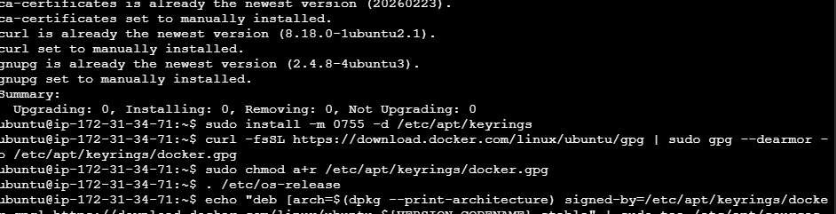

LALU AKTIFKAN DOCKER
"sudo systemctl enable docker"
"sudo systemctl start docker"
"sudo usermod -aG docker ubuntu"
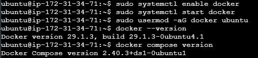

5. Set Up Docker Hub
Buat repoitory baru pada docker hub
"zaidanaliffirdaus/web-statis"
"zaidanaliffirdaus/web-dinamis"
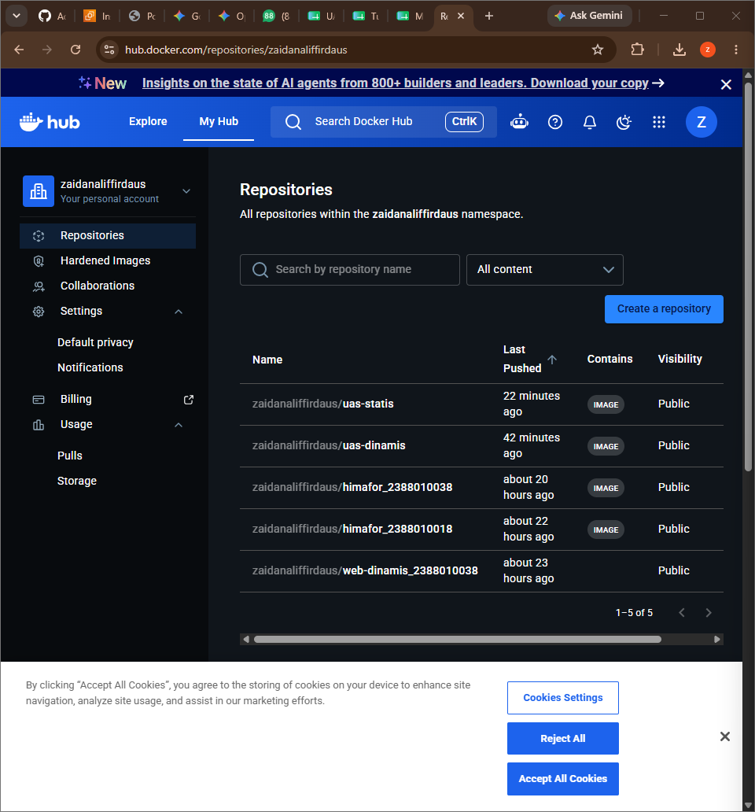

6. 

BUAT ACCESS TOKEN DOCKER HUB
"Account Settings -> Personal access tokens -> Generate new token"
"Permission : Read & Write"
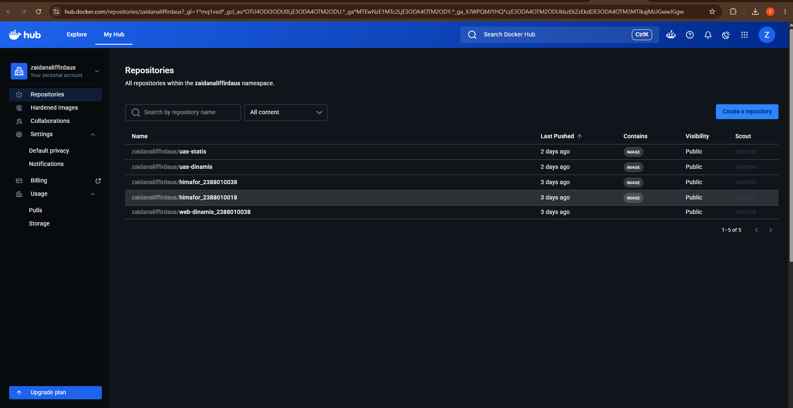

7. Login Docker ke EC2 melalui PowerShell
"docker login -u zaidanaliffirdaus"
"cd ~/uas-2388010038"
"docker compose build static-web dynamic-app"
"docker compose push static-web dynamic-app"
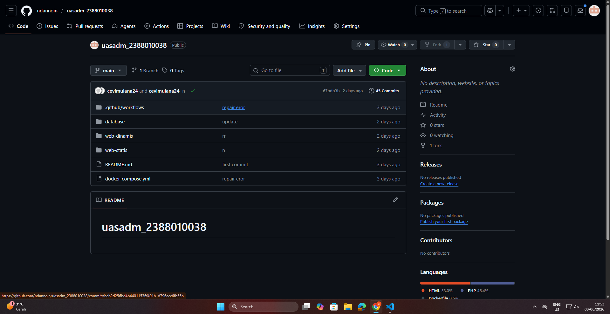

DOCKERHUB_USERNAME=zaidanaliffirdaus
DOCKERHUB_TOKEN=token_dockerhub_kamu
EC2_HOST=47.128.217.195
EC2_USER=ubuntu
EC2_SSH_KEY=isi_private_key_pem
STATIC_IMAGE=zaidanaliffirdaus/static-web:latest
DYNAMIC_IMAGE=zaidanaliffirdaus/dynamic-app:latest
DB_NAME=uas_db
DB_USER=uas_user
DB_PASSWORD=uas_password
MARIADB_ROOT_PASSWORD=root_password_change_me

8. Set Up Github Action
".github/workflows/deploy-static.yml"
".github/workflows/deploy-dynamic.yml"

COMMIT & PUSH WORKFLOW
"git status"
"git add .github/workflows/deploy-static.yml .github/workflows/deploy-dynamic.yml"
"git commit -m "Add GitHub Actions deployment workflows""
"git push origin main"
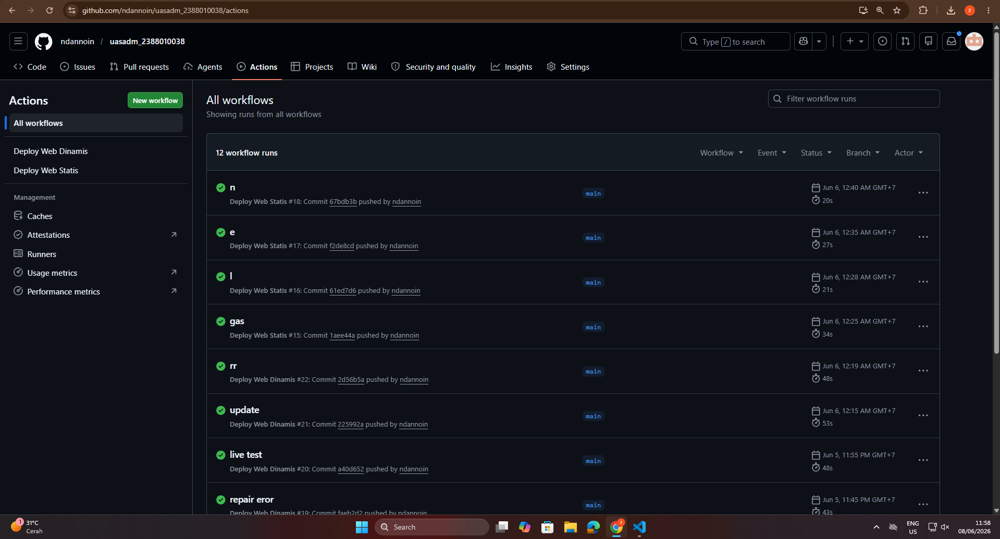

9. Tes Menjalankan Web Static & Dynamic
WEB STATIC
alt text

10. Live Test Zero Touch
STATIC
Mengubah 
Himpunan Resmi Mahasiswa UINSSC

Menjadi  
UAS ADMINISTRASI SERVER : CLOUD COMPUTING II

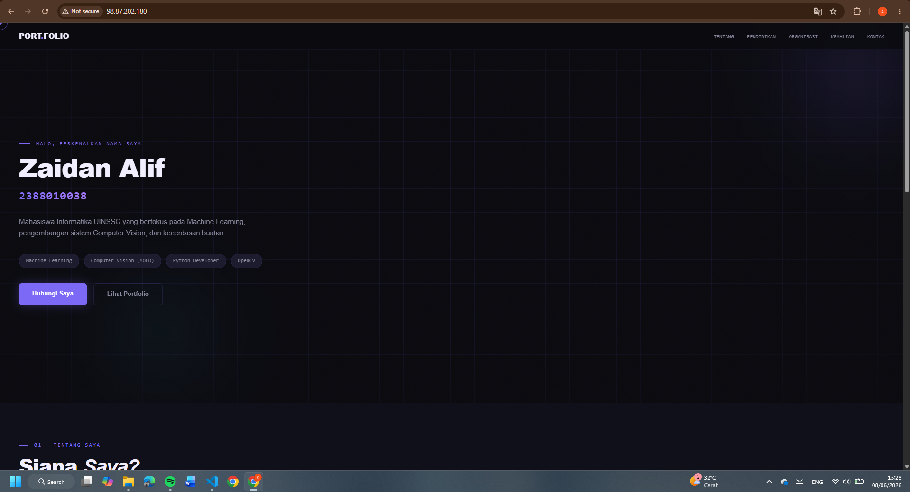

DYNAMIC
Mengubah 
UAS Administrasi Server

Menjadi 
UAS Administrasi Server | Cloud Computing II

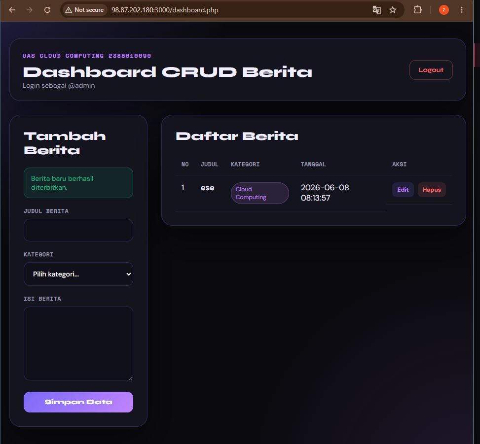