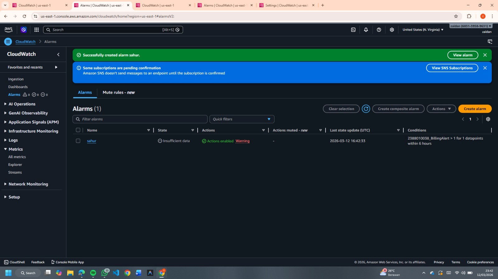
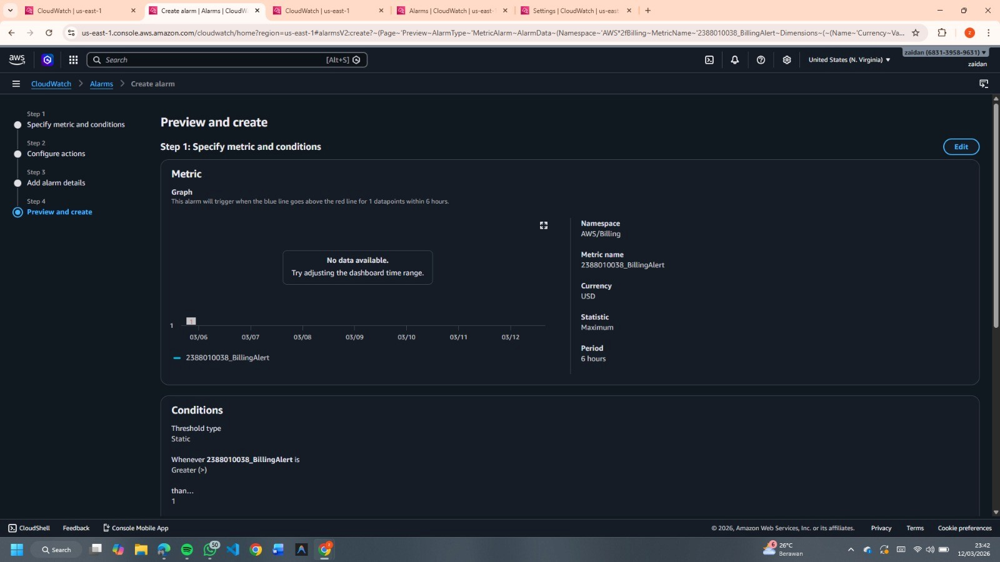

# Membuat Billing Alert di AWS

Tujuan: membuat **Billing Alert** agar dapat memonitor penggunaan biaya AWS dan menghindari **kelebihan alokasi dana**.

---

# 1. Mengaktifkan Billing Alert Notification

1. Buka **AWS Dashboard**.
2. Masuk ke menu **Billing and Cost Management**.
3. Pada halaman tersebut, scroll ke bawah lalu pilih **Billing Preferences**.
4. Masuk ke menu **Alert Preferences** lalu klik **Edit**.
5. Masukkan **Email** untuk menerima notifikasi.
6. Centang opsi **Receive Billing Alerts**.
7. Klik **Update**.

---

# 2. Membuka CloudWatch

1. Masuk ke **All Services**.
2. Pilih **CloudWatch**.

---

# 3. Membuat Alarm Billing

1. Pilih menu **Create Alarm**.
2. Pastikan **Region** berada di:

```
US East (N. Virginia)
```

3. Klik **Create Alarm**.
4. Klik **Select Metric**.

---

# 4. Memilih Metric Billing

1. Pilih menu **Billing**.
2. Pilih **Total Estimated Charge**.
3. Centang **mata uang USD**.
4. Klik **Select Metric**.

---

# 5. Konfigurasi Alarm

Isi konfigurasi berikut:

**Nama Alert**

```
NIM_BillingAlert
```

**Conditions**

```
Static
Greater than
1 USD
```

---

# 6. Membuat SNS Topic untuk Notifikasi

1. Pilih **Create New Topic**.
2. Isi nama topic:

```
NIM_BillingAlert
```

3. Klik **Create**.
4. Pilih **Select an existing SNS Topic**.
5. Pilih topic:

```
NIM_BillingAlert
```

6. Klik **Next**.

---

# 7. Finalisasi Alarm

1. Isi **Alarm Name**:

```
NIM_BillingAlert
```

2. Klik **Create Alarm**.

---

# 8. Konfirmasi Email

1. Buka **Inbox / Spam** pada email yang didaftarkan.
2. Cari email dari **AWS Notifications**.
3. Klik **Confirm Subscription** untuk mengaktifkan notifikasi billing.

