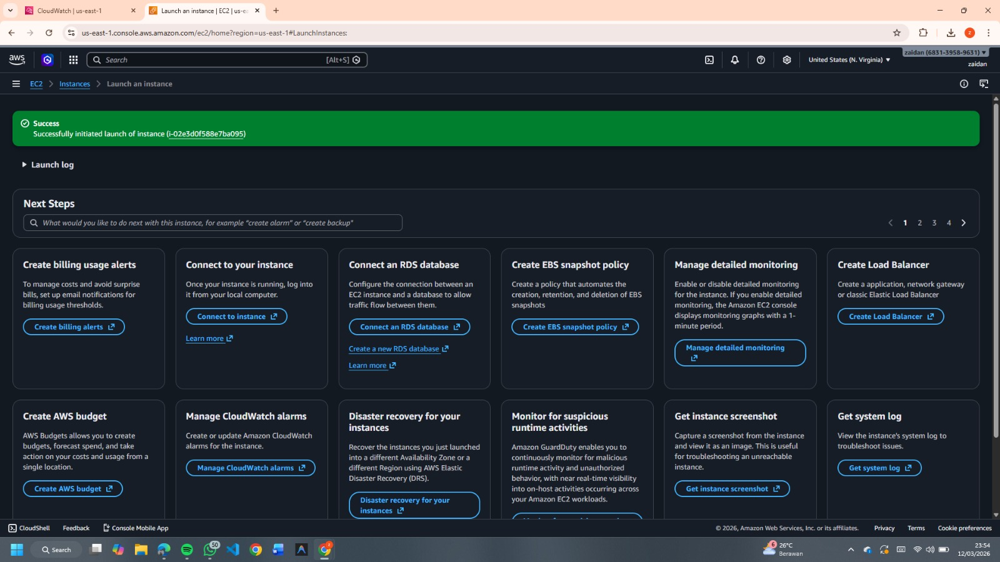
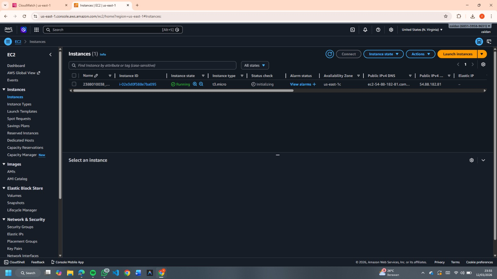

# Membuat VM / Instance di AWS EC2 dengan AMI

## Langkah-langkah

1. Buka **Dashboard AWS**.
2. Masuk ke menu **EC2**.
3. Klik **Launch Instance**.
4. Pastikan **Region** yang dipilih adalah yang **paling dekat**.

## Konfigurasi Instance

* **Nama Instance**
  `NIM_Server6A`

* **Operating System (OS)**
  `Linux Ubuntu`

* **Instance Type**
  `t3.micro`

## Membuat Key Pair

1. Klik **Create New Key Pair**
2. Isi **nama key pair**
3. Pilih format file **.pem**
4. Klik **Create**

## Network Security

Aktifkan rule berikut:

* Allow **SSH Traffic**
* Allow **HTTP**
* Allow **HTTPS**

## Storage Setting

* Kapasitas storage: **30 GB**

## Launch Instance

1. Klik **Launch Instance**
2. Pastikan muncul **alert / notifikasi Launch Success**

## Verifikasi Instance

1. Pastikan **nama instance sesuai** → `NIM_Server6A`
2. Klik **Instance** untuk melihat detail instance.
