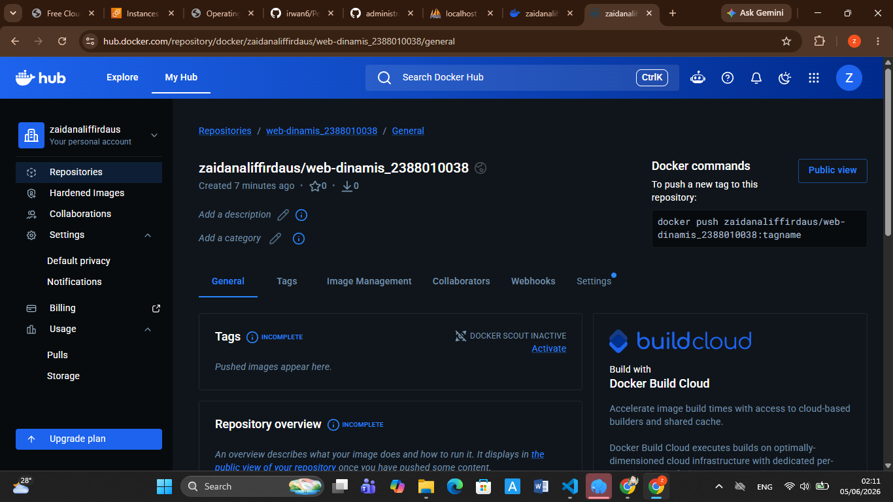
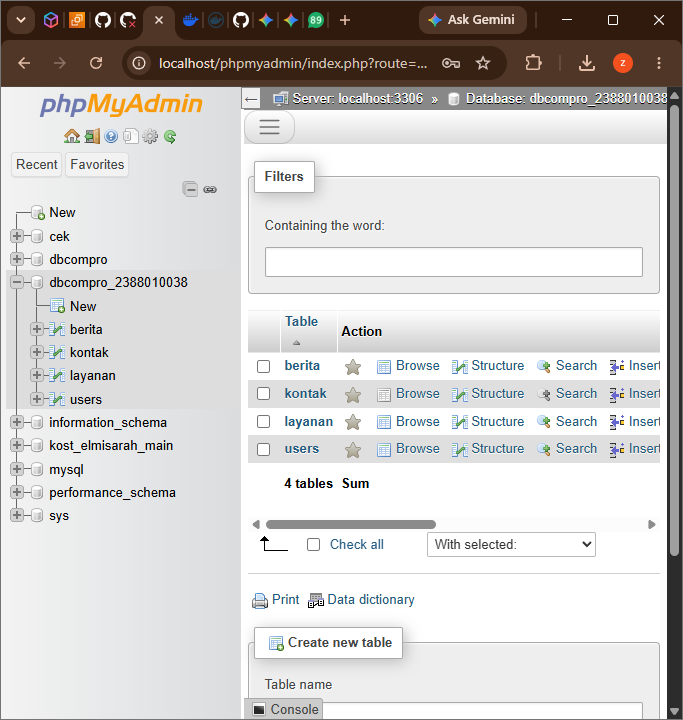
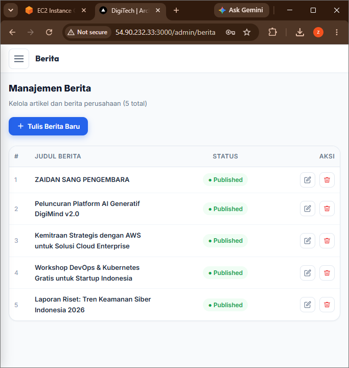
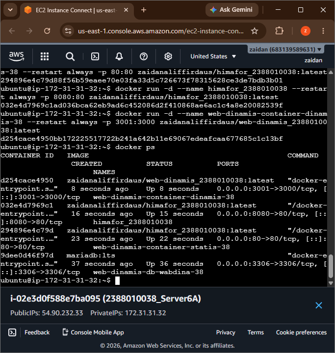
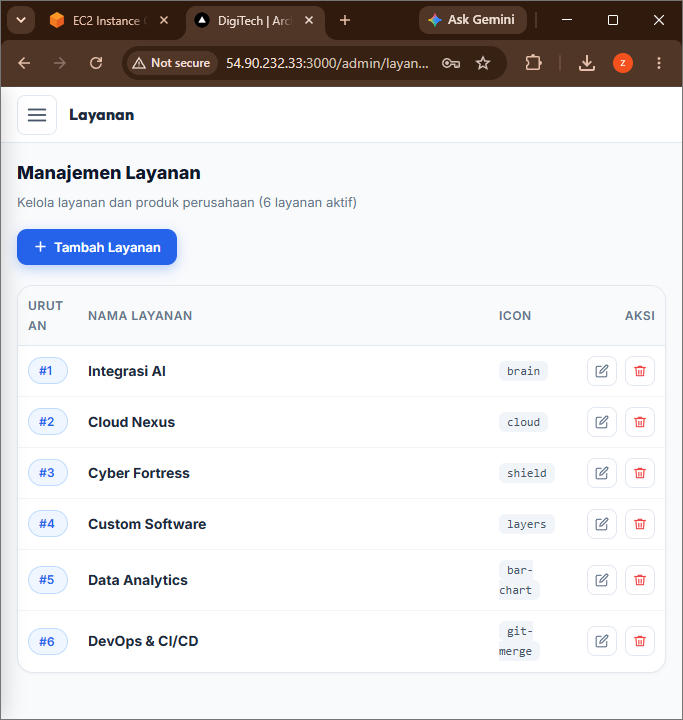

Deploy Multiple Container menggunakan Docker Compose
Start Instance EC2 di AWS

Patching OS

Uninstall semua Services manual sebelumnya

Repositori baru untuk web dinamis di docker hub 

Buka Projek Company himafor_nim

Bagi 2 Folder untuk projek Web App Statis dan Dinamis

Move file index dan Dcoker milik web statis ke Folder web-statis 

Copy Folder Projek Next.JS (pertemuan9)ke folder web-dinamis

Lakukan Testing di Local Project Next.JS

Install Dependencies: npm install
Create user di DBMS : sudo mysql -u root -p
CREATE USER 'userwebdinamis_nim'@'localhost' IDENTIFIED BY 'O)xz6GWEwDOx1Ea9';
GRANT ALL PRIVILEGES ON *.* TO 'userwebdinamis_nim'@'localhost';
FLUSH PRIVILEGES;
exit; 
Edit File .env di folder web-dinamis
npm run build
npm start
Pastikan web dapat diakses di http://localhost:3000 admin tanpa error 
Buat file Dockerfile

Buat file docker-compose.yml

Buat Workflows File -> deploy-dinamis.yml di folder .github/workflows/ dari Projek web-dinamis

Edit File -> deploy.yml di folder .github/workflows/ untuk

Update Host AWS di Github

Commit Changes ke GitHub dari lokal

Push Changes ke GitHub

Cek di Github, apakah actions jalan dan berhasil 

Cek di AWS, apakah container berjalan dengan baik 

Akses web melalui Browser login admin edit Layanan 

Referensi :

https://github.com/moh-firdaus/himafor_nim