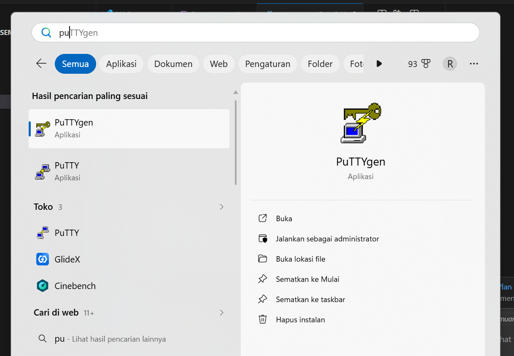
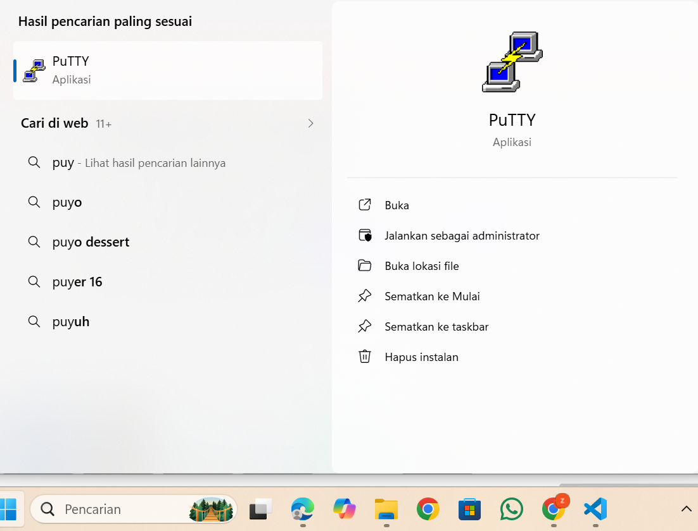
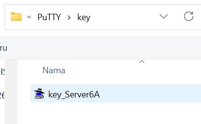
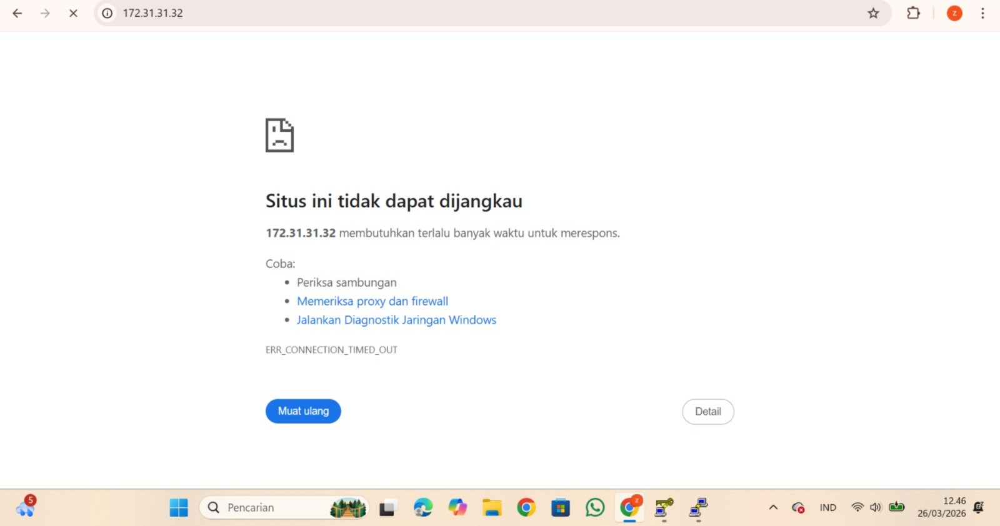
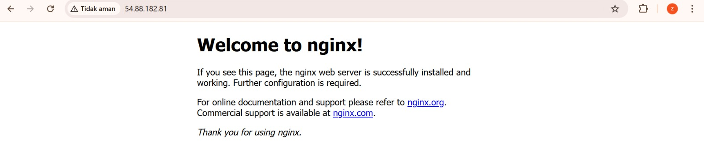

unduh dan Install Putty di https://www.chiark.greenend.org.uk/~sgtatham/putty/latest.html
alt text

Konversi ekstensi Private Key dari .pem menjadi .ppk

Buka Putty Gen
Load Private Key .pem
Klik Save Private Key menjadi ekstensi File .ppk alt text
Setting-Up Remote SSH dengan Putty

isi Ipv4 addres Public data berasal dari instance masing2
port SSH (22)
load private key .ppk di menu Connection->SSH->Auth->Credential
user dari instance masing-masing (ubuntu)
alt text

Setiap awal Remote kita lakukan Patching OS
sudo apt-get update && sudo apt-get upgrade
coba lakukan instalasi Web Server dalam keadaan Kosong alt text instal salah satu web server sudo apt install nginx alt text
